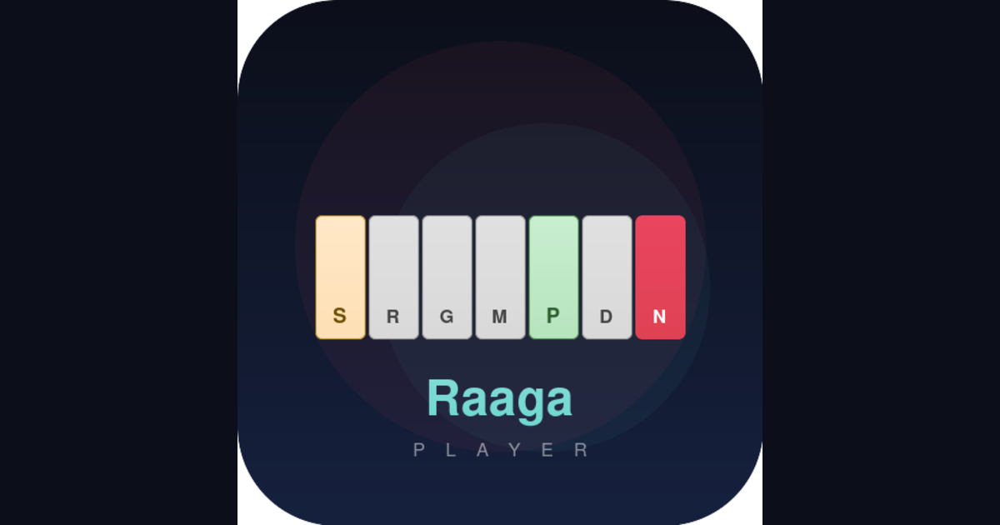

# Raaga Player


A browser-based Indian classical music keyboard that lets you play any raga — with no wrong notes.

Select a scale and every key on screen belongs to that raga. Slide your finger across and everything sounds musical. Built as a single HTML file with zero dependencies (beyond Google Fonts), so it runs anywhere — desktop, tablet, phone.

**[Try it live →](https://ravi-annaswamy.github.io/raaga-player/)**



## What's Inside

**98 scale presets out of the box:**

- All **72 Melakarta ragas** — the complete Carnatic system, generated algorithmically from chakra/position logic
- All **10 Hindustani Thaats** with their Melakarta equivalents noted
- **16 popular Janya ragas** (5 and 6 note scales) — Mohanam, Hamsadhwani, Hindolam, Abhogi, Madhyamavati, and more

**Three notation modes** — switch between Indian Sargam (S R₂ G₃ M₁ P D₂ N₃), Western (C D E F G A B), and frequency in Hz.

**Four tone options** — Tanpura (rich layered oscillators with sub-octave), Sine, Soft (triangle), and Bright (sawtooth), all synthesized with the Web Audio API.

**Touch-friendly** — Glissando mode lets you swipe across keys. Sustain holds notes until you toggle it off. Sa keys are gold, Pa keys are green, and active notes light up in red-orange.

## How to Use

1. Open `index.html` in any modern browser
2. Pick a raga from the dropdown or press `/` to search by name or number
3. Play! Click or tap keys. With Glissando on, drag across keys for smooth runs
4. Adjust the tonic (Sa = C3 through D4), octave range (1–4), and tone

## Tech

Single-file HTML/CSS/JS. No build step. No frameworks. Audio is pure Web Audio API synthesis — no samples to download. Fonts loaded from Google Fonts (Playfair Display for the title, Inter for the UI).

## Run Locally

Just open the file:

```
open index.html
```

Or serve it:

```
python3 -m http.server 8080
```

## License

MIT — do whatever you want with it.

---

*Built by Ravi Chandran*
